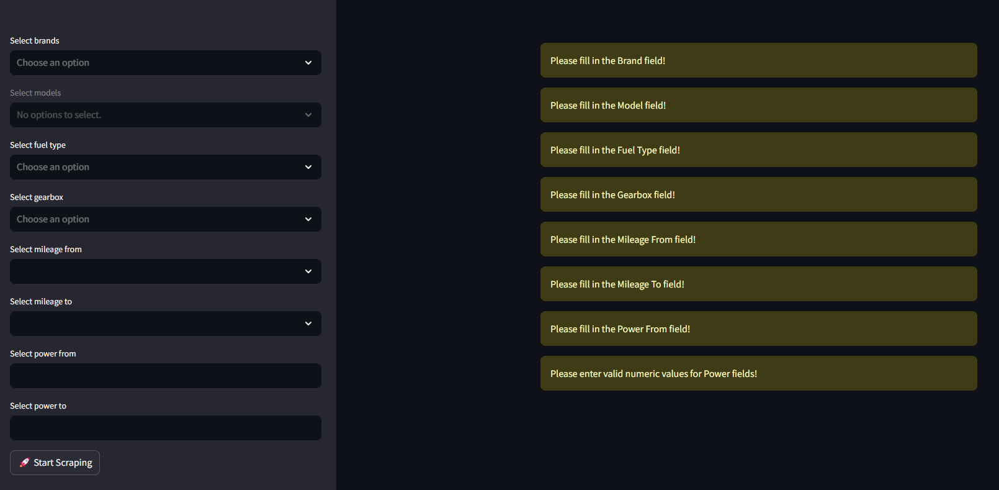
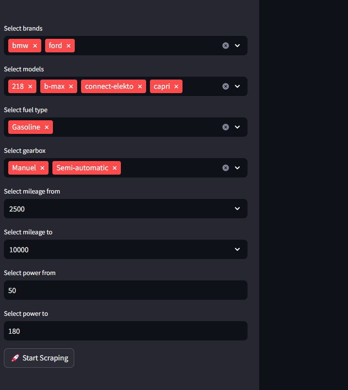
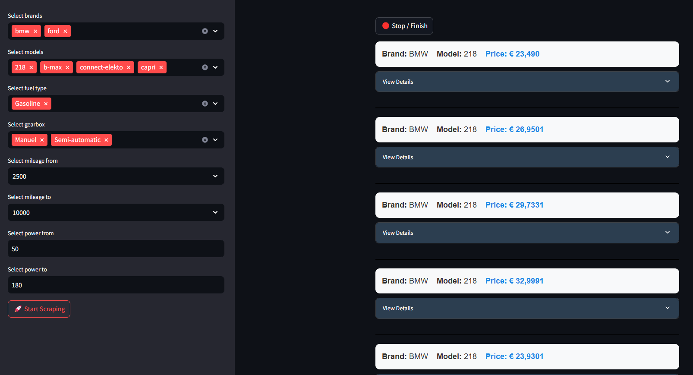
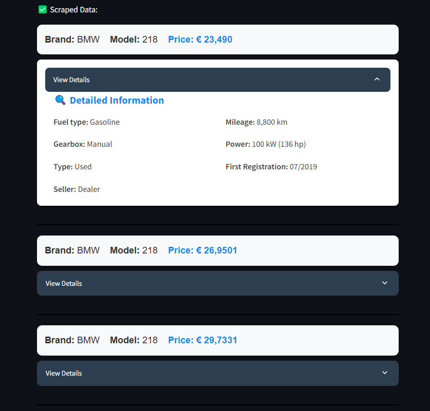
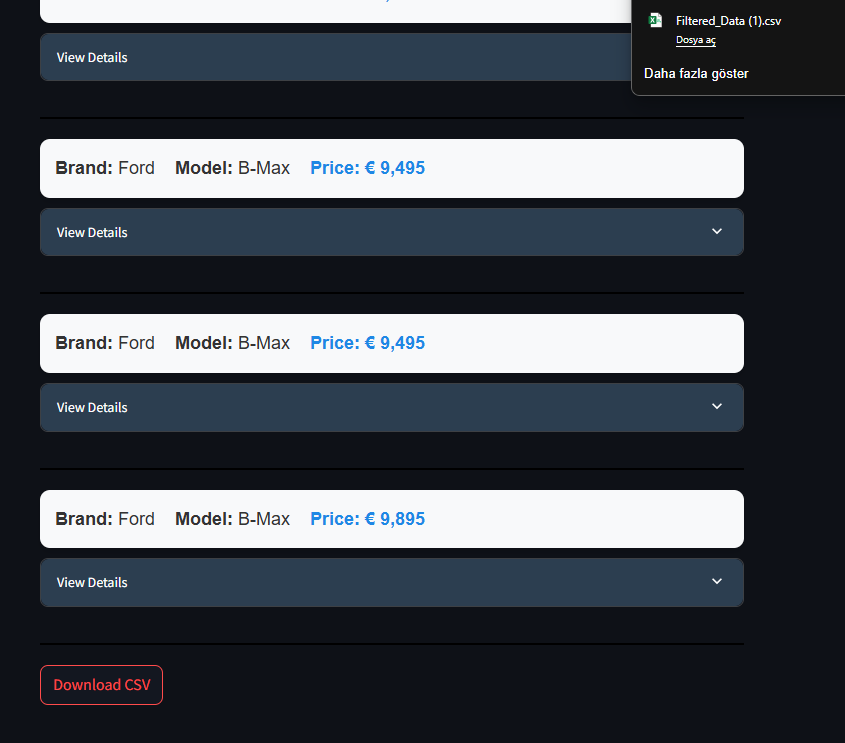

# 🚗 AutoScout24 Dynamic Data Scraper

A dynamic and user-friendly web scraping tool built with **Python**, **Streamlit**, and **Selenium**, designed to extract car listings from [AutoScout24](https://www.autoscout24.com).  
The application allows users to filter data in real-time based on their selected criteria and download the results as a CSV file.

> 📌 **Goal:** Efficiently collect structured car listing data for analysis, research, or business intelligence purposes.

---

## ✨ Features

- ✅ **Dynamic Filtering**  
  Select brand, model, fuel type, gearbox, mileage range, and power specifications dynamically.
  
- ✅ **Real-Time Data Extraction**  
  Data is scraped instantly based on selected filters, no need to refresh manually.

- ✅ **Data Validation**  
  Ensures correct input values for mileage and power fields (numeric control and logical consistency).

- ✅ **Card-Based UI Display**  
  Clean and interactive design displaying scraped data as individual cards.

- ✅ **Export Functionality**  
  Download the filtered dataset as a CSV file for further analysis.

- ✅ **Performance Optimization**  
  Improved browser driver management to minimize resource consumption.

---

## 🖼️ Screenshots

> Main Without Filtration
|  | 

> Sidebad With Filtration
|  | 

> Program's Look While Fetching Data 
|  | 

> Fetched Data With Detailed Look
|  | 

> After Fetching The Data Download it
|  | 

---

## ⚙️ Installation & Usage

### 1. Clone the repository
> git clone https://github.com/BurakCANKURT/autoscout24-online-scraper.git

>  cd autoscout24-online-scraper

### 2. Install dependencies
> pip install -r requirements.txt

### 3. Run the application
> streamlit run Main.py

### 4. Use the app
- Set your filters on the sidebar.
- Click Start Scraping to begin data extraction.
- Review the data displayed as cards.
- Download the data as a CSV file.

```bash
git clone https://github.com/your-username/your-repository.git
cd your-repository


🚀 Tech Stack
├── Python 3.8+
├── Streamlit
├── Selenium WebDriver
├── WebDriver Manager 
├── Pandas
└── psutil
    

    
🗂️ Project Structure
├── Main.py                 # Main application file
├── OnlineAutoscout24.py    # Web scraper class
├── ScrapElements.py        # Required scraping elements file
├── requirements.txt        # Dependencies list
├── README.md               # Project documentation
└── images/                 # Screenshots & visual assets


Enjoy your data scraping!
